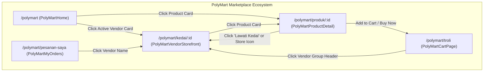

# PolyMart SuperApp: Vendor Storefront & Product Detail Revamp Design Specification

**Date:** 2026-10-05  
**Status:** Approved by User (Updated with Slide-Up Variation Sheet & Smart Preset Ambient Mesh)  
**Target Module:** `/polymart/*`  
**Key Routes:**
- `/polymart/kedai/:id` (New: Personalized Vendor Storefront Page)
- `/polymart/produk/:id` (Revamped: Mobile-First Product Detail Page)
- Cross-linking from `PolyMartHome.tsx`, `PolyMartCartPage.tsx`, and `PolyMartMyOrders.tsx`

---

## 1. Executive Summary & Design Read

> **Design Read:**  
> *"Modern Mobile-First E-Commerce SuperApp for POLISAS students & student entrepreneurs, using the Obsidian-Amber (`#f59e0b`) brand language, built on Tailwind utilities + Lucide Icons + Motion + hairline border depth. Eliminates 100% of raw emojis in favor of crisp vector icons. Carefully coordinates with the existing global `BottomNav` to guarantee zero overlapping bar collisions or redundant chrome."*

### Key Strategic Objectives:
1. **Personalized Vendor Storefront (`/polymart/kedai/:id`):** Transform currently unclickable active vendors into a dedicated Shopee/TikTok Shop-style merchant storefront featuring a verified student seller badge, live store metrics, and 3 organized tabs (*Semua Produk*, *Paling Laris*, *Info & Lokasi Ambil*).
2. **Smart Preset Ambient Mesh for Vendor Banner:** When a student merchant does not upload a custom cover banner, the system automatically renders an executive Obsidian-Amber ambient mesh with geometric category vector watermark so the store always looks expensive, branded, and professional.
3. **Mobile-First Product Detail Revamp (`/polymart/produk/:id`):** Replace raw 100px emojis with Lucide vector squircle fallbacks, add a multi-image thumbnail filmstrip, and introduce a sticky bottom action dock.
4. **Ergonomic Slide-Up Variation Bottom Sheet:** Replace outdated centered modal boxes with a thumb-friendly slide-up bottom sheet for variation picking, dynamic pricing, and stock-capped quantity adjustment.
5. **Deduplicated Chrome & Viewport Stability:** Suppress the global `<BottomNav />` conditionally on `/polymart/produk/*` so the dedicated Product Purchase Dock takes precedence without stacking, overlapping, or causing viewport overflow. On `/polymart/kedai/:id` and `/polymart`, `<BottomNav />` remains active.
6. **Senior Performance & Business Logic Guardrails:** 0% changes to cart schema, order RPCs, payment deadlines, or Supabase realtime subscriptions. 0 heavy `backdrop-blur` on repeated product cards for 60fps scrolling on budget student phones.

---

## 2. Architecture & Component Hierarchy



### Component Breakdown

| Component | File Path | Route | Purpose |
|---|---|---|---|
| `PolyMartLayout` | `src/pages/polymart/PolyMartLayout.tsx` | All `/polymart/*` | Top header, stadium search capsule, vector categories, and conditional `BottomNav` rendering (suppressed on `/polymart/produk/*`). |
| `PolyMartVendorStorefront` | `src/pages/polymart/PolyMartVendorStorefront.tsx` | `/polymart/kedai/:id` | **NEW:** Dedicated public merchant storefront (banner cover with Smart Ambient Mesh fallback, verified badge, stats strip, tabbed catalog, direct chat/WhatsApp). |
| `PolyMartProductDetail` | `src/pages/polymart/PolyMartProductDetail.tsx` | `/polymart/produk/:id` | **REVAMPED:** Mobile-first product view with Lucide vector squircle fallbacks, image gallery filmstrip, interactive merchant card, "Produk Lain dari Kedai Ini" carousel, and sticky bottom purchase dock. |
| `ProductVariationBottomSheet` | Subcomponent inside `PolyMartProductDetail.tsx` | N/A (Sheet) | **NEW:** Slide-up bottom sheet for variation and quantity selection (replaces centered box modal). |
| `BusinessCard` | `src/pages/polymart/PolyMartHome.tsx` | `/polymart` | Updated to route directly to `/polymart/kedai/:bizId` on click. |

---

## 3. Detailed Specifications

### 3.1 Personalized Vendor Storefront (`/polymart/kedai/:id`)

1. **Cover & Store Profile Header:**
   - **Smart Preset Ambient Mesh (Cover Fallback):**
     - If `business.cover_url` exists: render the merchant's high-res cover image with subtle bottom gradient scrim.
     - If `business.cover_url` is missing: **automatically generate an executive Obsidian-Amber mesh**:
       ```css
       bg-gradient-to-br from-amber-950 via-slate-900 to-stone-950 border-b border-amber-500/20 relative overflow-hidden
       ```
       with two layered radial glows (`bg-amber-500/15 blur-3xl`) and a large subtle geometric vector category watermark (e.g. `Utensils`, `Shirt`, `Wrench`, `Package`) positioned at the right corner with 10-15% opacity. Never display a drab, empty gray box.
   - **Avatar Squircle:** `w-16 h-16 sm:w-20 sm:h-20 rounded-2xl border-2 border-white/20 bg-muted/40 shadow-lg overflow-hidden shrink-0` displaying `business.logo_url` or a fallback `<Store className="w-8 h-8 text-amber-500" />`.
   - **Verification Badge:** Lencana rasmi `Peniaga Siswa Sah POLISAS` (`inline-flex items-center gap-1 px-2.5 py-0.5 rounded-full bg-emerald-500/15 border border-emerald-500/30 text-emerald-600 dark:text-emerald-400 text-[10px] font-black uppercase tracking-wider`). If `is_ems_siswapreneur`, display `Siswapreneur EMS`.
   - **Business Details:** Store name in bold typography, optional tagline/description, registered department/club affiliation if available.
   - **Action Bar:**
     - `Sembang Peniaga`: Opens in-app Polymart Chat modal directly targeting this `business.id`.
     - `WhatsApp`: Direct `https://wa.me/` link if phone exists and contact method is WhatsApp.
     - `Kongsi Kedai`: Web Share API / Copy Link toast notification.

2. **Live Store Metrics Strip (*Jalur Metrik Langsung*):**
   - Single-line horizontal container with hairline border (`bg-card/70 dark:bg-slate-900/70 border border-border/60 rounded-2xl p-3 grid grid-cols-3 gap-2 text-center`):
     - ⭐ **Penilaian:** Store rating average & review count (e.g. `4.8 ★ (24 ulasan)`).
     - 📦 **Produk:** Total active published products for this vendor.
     - 💳 **Bayaran:** Badges for `DuitNow QR` and/or `Tunai (COD)` based on `online_payment_enabled` and `cod_enabled`.

3. **Store Navigation Tabs (*Tab Navigasi Kedai*):**
   - Sleek segmented pill track:
     - **Tab 1: Semua Produk:**
       - Search input within the store.
       - Category chips specific to the vendor's products.
       - Grid of products using the lightweight `ProductCard` structure (hairline border, no heavy blur, 60fps scrolling).
     - **Tab 2: Paling Laris (*Best Sellers*):**
       - Top items sorted by order count and rating.
     - **Tab 3: Info & Lokasi Ambil:**
       - Delivery / Pickup locations (e.g., Kamsis Siswa/Siswi, Kafeteria, Dewan Jubli).
       - Business hours / operating days.
       - Payment instructions and contact details.

4. **Empty States:**
   - Vector squircle with `<PackageSearch className="w-8 h-8 text-amber-500" />` and clean message: *"Kedai ini belum memuat naik produk aktif."*

---

### 3.2 Mobile-First Product Detail Revamp (`/polymart/produk/:id`)

1. **Suppression of Global `BottomNav` on Product Detail:**
   - In `PolyMartLayout.tsx`:
     ```tsx
     {!(
       location.pathname.includes('/polymart/vendor') ||
       location.pathname.includes('/polymart/admin') ||
       location.pathname.includes('/polymart/produk/')
     ) && (
       <div className="tour-polymart-mobile-nav">
         <BottomNav ... />
       </div>
     )}
     ```
   - **Rationale:** Prevents vertical stacking collision between the general app navigation and the commerce purchase dock.

2. **Mobile Sticky Bottom Action Dock:**
   - Fixed at the bottom on mobile screens (`fixed bottom-0 left-0 right-0 z-40 bg-card/95 dark:bg-slate-950/95 backdrop-blur-md border-t border-border/60 p-3 pb-[max(0.75rem,env(safe-area-inset-bottom))] flex items-center justify-between gap-3 shadow-lg`):
     - **Left Actions (Micro-Pills):**
       - **Kedai:** `<button onClick={() => navigate('/polymart/kedai/' + business.id)} className="flex flex-col items-center justify-center gap-0.5 text-muted-foreground hover:text-foreground"> <Store className="w-4 h-4 text-amber-500" /> <span className="text-[9px] font-bold">Kedai</span> </button>`
       - **Sembang:** `<button onClick={handleOpenChat} className="flex flex-col items-center justify-center gap-0.5 text-muted-foreground hover:text-foreground"> <MessageCircle className="w-4 h-4 text-emerald-500" /> <span className="text-[9px] font-bold">Sembang</span> </button>`
       - **Troli:** `<button onClick={() => navigate('/polymart/troli')} className="relative flex flex-col items-center justify-center gap-0.5 text-muted-foreground hover:text-foreground"> <ShoppingCart className="w-4 h-4 text-amber-500" /> <span className="text-[9px] font-bold">Troli</span> {cartCount > 0 && <span className="absolute -top-1 -right-1 w-4 h-4 bg-rose-500 text-white text-[9px] font-black rounded-full flex items-center justify-center">{cartCount}</span>} </button>`
     - **Right Actions (Twin Purchase Buttons):**
       - **+ Troli:** Triggers the **Slide-Up Bottom Sheet** in 'CART' mode (`h-11 px-4 rounded-xl bg-amber-500/15 border border-amber-500/30 text-amber-600 dark:text-amber-400 font-bold text-xs hover:bg-amber-500/25 active:scale-95 transition-all`).
       - **Beli Sekarang:** Triggers the **Slide-Up Bottom Sheet** in 'BUY' mode (`h-11 px-5 rounded-xl bg-amber-500 text-slate-950 font-black text-xs hover:bg-amber-400 active:scale-95 shadow-md shadow-amber-500/20 transition-all flex items-center gap-1.5`).
   - Content container configured with `pb-28` to ensure all content scrolls cleanly above the dock.

3. **Ergonomic Slide-Up Variation Bottom Sheet (Shopee / TikTok Shop Pattern):**
   - Replaces the old centered modal box.
   - Built with Framer Motion: slides up smoothly from viewport bottom (`initial={{ y: '100%' }} animate={{ y: 0 }} exit={{ y: '100%' }}`).
   - **Drag Pill Handle:** Centered top handle for thumb gesture dismiss.
   - **Header Preview:**
     - Product thumbnail squircle (`w-16 h-16 rounded-2xl border border-border/50 overflow-hidden shrink-0`).
     - Dynamic Price: updates in real-time if a variation has a price modifier or sale price.
     - Live Stock Indicator: displays remaining available stock (`Stok: X`).
   - **Variation Options (Chips):**
     - Selectable pill chips (e.g. `Kecil`, `Sederhana`, `Besar`, `Pedas`, `Manis`).
     - Selected chip styled with high-contrast amber border & background (`border-amber-500 bg-amber-500/15 text-amber-600 dark:text-amber-400 font-bold`).
   - **Quantity Stepper:**
     - Sleek counter with `[-] [qty] [+]` buttons, clamped between 1 and available stock.
   - **Pickup / Order Details:**
     - Pickup time selection input and note to seller.
     - Payment method toggle (`DuitNow QR` or `COD`).
   - **Confirmation Action:**
     - Sticky bottom button: `Sahkan & Tambah ke Troli` (if triggered from + Troli) or `Teruskan Tempahan` (if triggered from Beli Sekarang).

4. **Modern Media Gallery & Fallback:**
   - Multi-image swipe container with thumbnail strip indicator (`flex gap-2 overflow-x-auto pb-1`).
   - Missing image fallback replaced with an amber vector squircle:
     `<div className="w-20 h-20 rounded-3xl bg-amber-500/15 border border-amber-500/30 flex items-center justify-center text-amber-600 dark:text-amber-400 shadow-sm"><FallbackIcon className="w-10 h-10" /></div>`
     where `FallbackIcon = CATEGORY_ICON_MAP[product.category] || Package`.
   - Badges updated to Lucide vector chips:
     - Sale: `<div className="inline-flex items-center gap-1 px-2.5 py-0.5 rounded-full bg-rose-500 text-white text-[10px] font-black"><Zap className="w-3 h-3" /> SALE -{discount}%</div>`
     - Pre-order: `<div className="inline-flex items-center gap-1 px-2.5 py-0.5 rounded-full bg-indigo-500 text-white text-[10px] font-black"><Clock className="w-3 h-3" /> PRA-TEMPAHAN</div>`

5. **Interactive Vendor Card & "Produk Lain dari Kedai Ini":**
   - Clickable card navigating to `/polymart/kedai/${business.id}` with avatar squircle, verified tag, rating, and a clear `Lawati Kedai <ChevronRight />` button.
   - Horizontal snap carousel below the vendor card showcasing other items from the same business (`select * from business_products where business_id = ... and id != currentId and is_available = true limit 8`).

6. **Elimination of Raw Emojis:**
   - Order sheet, report dialog, and CTAs completely purged of raw emojis (`🛍️, 🛒, 😔, ⚠️, ✅, 📦`), replaced with Lucide icons (`ShoppingBag`, `ShoppingCart`, `AlertCircle`, `CheckCircle2`, `Package`).

---

## 4. Cross-Navigation Updates

1. **`PolyMartHome.tsx`:**
   - `BusinessCard` click handler updated to navigate to `/polymart/kedai/${biz.id}` (replacing the previous `?vendor=...` URL parameter).
2. **`PolyMartCartPage.tsx`:**
   - Business group header made clickable: `<div onClick={() => navigate('/polymart/kedai/' + business.id)} className="cursor-pointer hover:text-amber-500 ...">`
3. **`PolyMartMyOrders.tsx`:**
   - Vendor name on order card made clickable: `<button onClick={() => navigate('/polymart/kedai/' + order.business_id)} ...>`

---

## 5. Senior Guardrails & Quality Constraints

1. **Guardrail 1 (Student Phone Performance - 60fps Scrolling):**
   - Lightweight styling on product cards in both `/polymart/kedai/:id` and `/polymart/produk/:id`.
   - 0 heavy `backdrop-blur` or multi-layer glow across product grids.
   - Hairline borders (`border border-border/60 hover:border-amber-400/50`) with native hardware acceleration.
2. **Guardrail 2 (No Chrome Collision / Viewport Stability):**
   - Global `BottomNav` is conditionally suppressed on `/polymart/produk/*` to prevent overlapping or redundant double-docking.
   - Main container padding `pb-28` prevents content from clipping under the purchase dock.
3. **Guardrail 3 (Brand Identity Discipline):**
   - PolyMart's Obsidian-Amber identity (`#f59e0b`) is strictly maintained.
4. **Guardrail 4 (0% Logic / Database Disruption):**
   - 0 changes to database tables, RPCs, cart queries, or payment order processing.

---

## 6. Testing & Verification Plan

1. **Unit & Integration Tests (`src/__tests__/polymartSuperApp.test.ts` & new tests):**
   - Verify `PolyMartVendorStorefront` exports a valid React component and renders store banner, metrics strip, tabs, and products.
   - Verify `PolyMartProductDetail` renders the mobile sticky dock with Quick Chat, Visit Store, Cart badge, and Twin CTAs.
   - Verify `PolyMartProductDetail` renders the slide-up bottom sheet when purchase/cart actions are triggered.
   - Verify 0 raw emojis in `PolyMartProductDetail.tsx` and `PolyMartVendorStorefront.tsx`.
   - Verify `PolyMartLayout.tsx` suppresses `BottomNav` on `/polymart/produk/*`.
2. **Repository Regression Test Suite:**
   - `npm test -- --run` (all 17+ test suites must pass 100%).
3. **Production Build Gate:**
   - `npm run build` must compile with 0 bundling or TypeScript errors.
